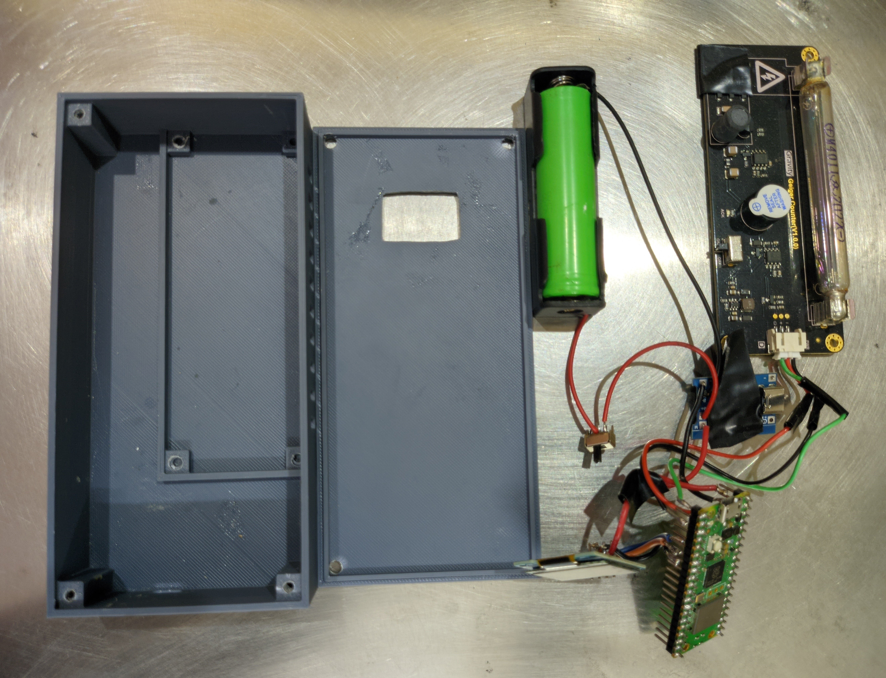
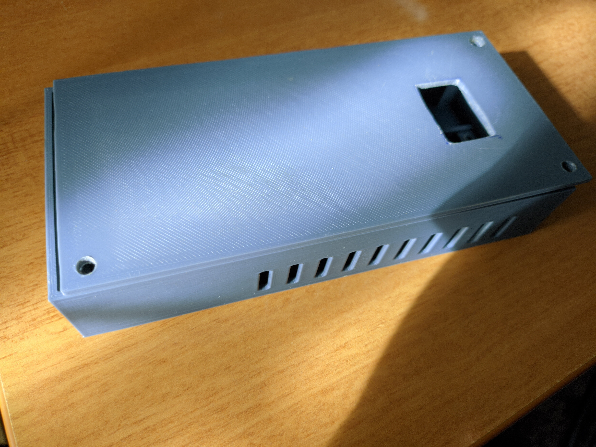
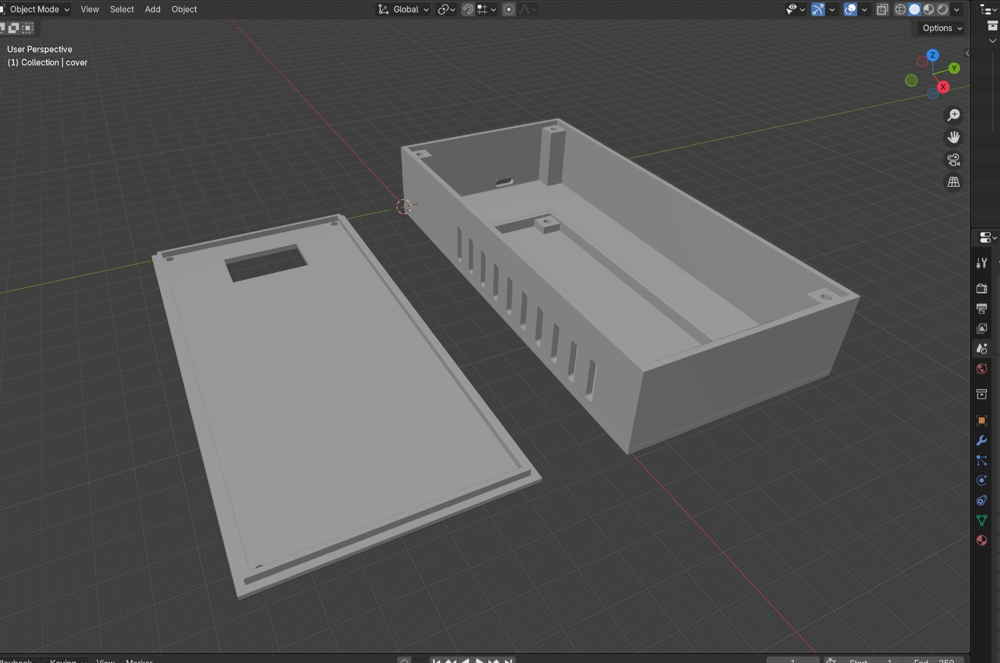
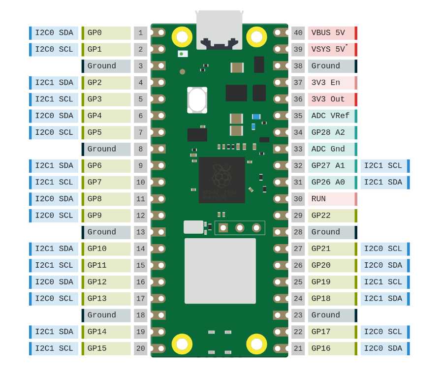
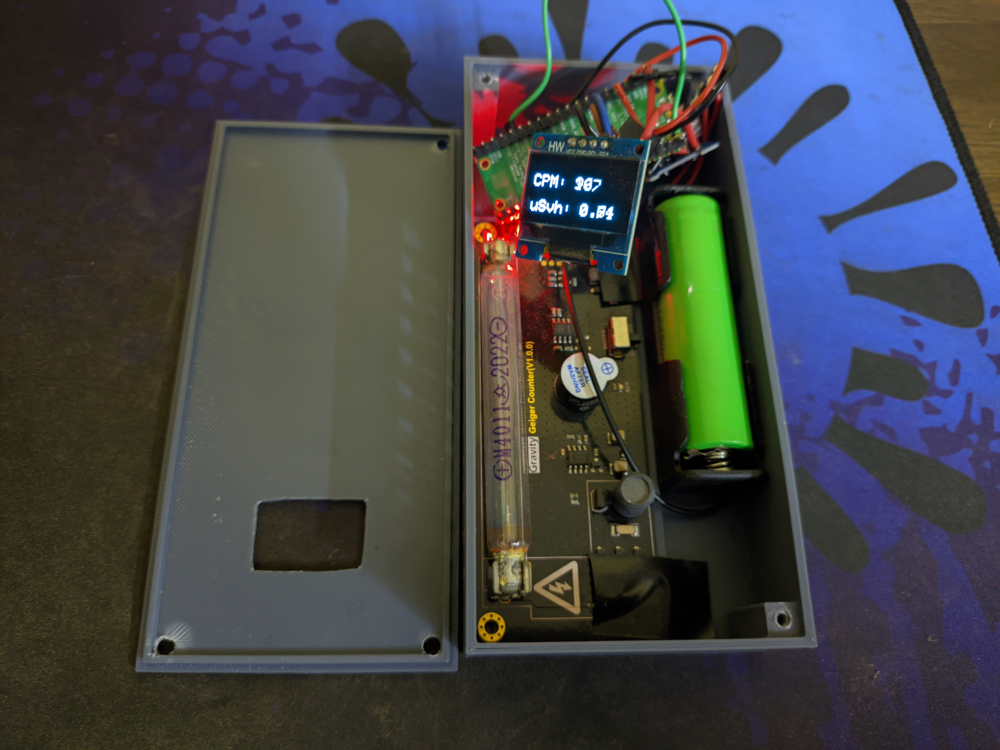
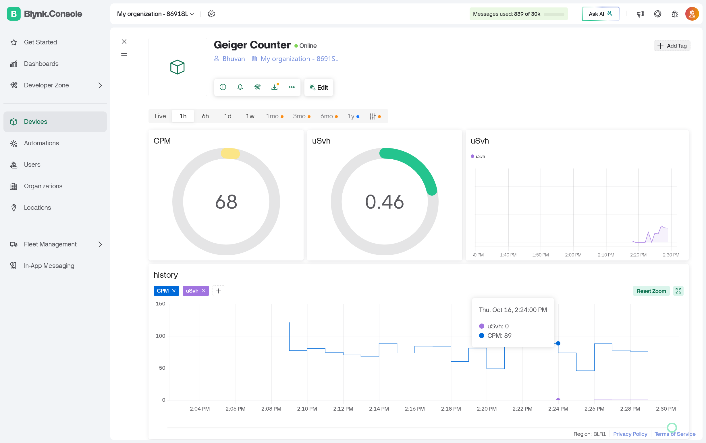

# ☢️ Geiger-Counter-Pico  
**Portable IoT Geiger Counter with Raspberry Pi Pico W**

An open-source radiation monitoring project using a **Raspberry Pi Pico W**, **DFRobot Geiger counter**, **OLED display**, and **Blynk IoT** to measure and upload background radiation data (CPM / µSv·h⁻¹) in real time.

---

## Hardware

### Components Used

| Component | Description | Notes / Links |
|------------|-------------|----------------|
| **Raspberry Pi Pico W** | Wi-Fi enabled RP2040 microcontroller | [arduino-pico core by Earle Philhower](https://github.com/earlephilhower/arduino-pico) |
| **OLED Display (0.96″, SSD1306)** | I²C display for showing CPM and µSv/h | Connected via GP4 (SDA) and GP5 (SCL) |
| **Gravity: Geiger Counter Module (SEN0463)** | Ionizing radiation detector | [DFRobot Wiki](https://wiki.dfrobot.com/SKU_SEN0463_Gravity_Geiger_Counter_Module) |
| **Charging Controller** | TP4056 (or similar) | Handles lithium battery charging from VSYS |
| **Li-ion Battery** | — | Connected through the charging controller |
| **3D Printed Body** | Custom enclosure for the project | Image: [`/media/geiger-counter-body-image.jpeg`](./media/geiger-counter-body-image.jpeg)<br>STL Files: [`body`](./media/geiger-counter-body.stl), [`lid`](./media/geiger-counter-body-lid.stl) |
| **Jumper Wires** | For all internal connections | — |

### Component Images



#### 3D Printed Enclosure



The Geiger counter enclosure was designed and printed to house all components securely.  

- [Body STL](./media/geiger-counter-body.stl)  
- [Lid STL](./media/geiger-counter-body-lid.stl)

**3D Model (Blender Preview):**  


---

### Raspberry Pi Pico W Pinout

  
Source: [https://picow.pinout.xyz/](https://picow.pinout.xyz/)

| Component | Function | Pico W Pin | Notes |
|------------|-----------|-------------|-------|
| **Geiger Counter Sensor** | Interrupt signal (detection) | GP0 | Connect sensor pulse output |
| | Power + | **3V3 OUT** | Regulated 3.3 V supply |
| | Ground – | **Any GND pin** | Common ground |
| **OLED Display (SSD1306)** | SDA (data) | GP4 | I²C data |
| | SCL (clock) | GP5 | I²C clock |
| | Power + | **VSYS (5 V, pin 39)** | Display VCC |
| | Ground – | **Any GND pin** | Common ground |
| **Charging Controller** | Power + input | **VSYS (5 V)** | Battery charging input |
| | Ground – | **Any GND pin** | Common ground |
| | Battery connection | Direct positive/negative to battery | For charging circuit |

---

## Overview

This project reads radiation counts from a **Geiger sensor**, displays live readings on a **0.96″ SSD1306 OLED**, and sends them to the **Blynk IoT Cloud** for remote monitoring via Wi-Fi.

## Installation Procedure

### 1. Install Arduino IDE

Download and install from  
[https://www.arduino.cc/en/software](https://www.arduino.cc/en/software)

### 2. Add Raspberry Pi Pico W Support

1. Open **File → Preferences** in Arduino IDE.  
2. In **Additional Boards Manager URLs**, add this link: [arduino-pico](https://github.com/earlephilhower/arduino-pico/releases/download/global/package_rp2040_index.json)
3. Go to **Tools → Board → Boards Manager…**  
Search for **pico** and install  
**“Raspberry Pi RP2040 Boards (by Earle F. Philhower, III)”**
4. Select your board:  
**Tools → Board → Raspberry Pi RP2040 Boards → Raspberry Pi Pico W**

### 3. Install Required Libraries

| Library | Purpose | Installation |
|----------|----------|--------------|
| **Adafruit SSD1306** | OLED display driver | Library Manager / [GitHub](https://github.com/adafruit/Adafruit_SSD1306) |
| **Adafruit GFX Library** | Required dependency for SSD1306 | Library Manager |
| **DFRobot Geiger** | Geiger sensor driver | [GitHub](https://github.com/cdjq/DFRobot_Geiger) → Download ZIP → **Sketch → Include Library → Add .ZIP Library…** |
| **Blynk** | IoT communication | Library Manager / [GitHub](https://github.com/blynkkk/blynk-library) |
| **WiFi** | Built into Pico W core | — |
| **Wire** | Built-in I²C library | — |

### 4. Configure Blynk IoT Dashboard

1. Create an account at [https://blynk.cloud/](https://blynk.cloud/).  
2. Create a new **template** named **“Geiger Counter”**.  
3. Copy your **Template ID**, **Name**, and **Auth Token** into the code.  
4. In the Blynk web dashboard, add:
- **V0 → CPM** (Counts Per Minute)  
- **V1 → µSv/h** (Radiation Dose Rate)

---

## Upload & Run

Before uploading, make sure your Raspberry Pi Pico W is connected via USB and that you have configured your Wi-Fi and Blynk credentials inside the code.

1. Clone or download this repository.  
2. Open the main sketch: [`geiger_counter.ino`](./src/geiger_counter.ino)  
3. Edit the Wi-Fi credentials and Blynk Auth Token near the top of the file:

```cpp
char ssid[] = "YourWiFiName";
char pass[] = "YourPassword";
#define BLYNK_AUTH_TOKEN "YourAuthToken"
```

4. Select your board and port in Tools.
5. Click Upload.

Once uploaded, the Pico W will automatically connect to Wi-Fi and begin sending live data to your Blynk dashboard.

## Operation

After rebooting, the Geiger counter begins operating immediately.

### Device Behavior

The Gravity Geiger Counter module detects ionizing radiation pulses via its interrupt pin (GP0).
The Pico W computes and displays:
- CPM (Counts Per Minute)
- µSv/h (Microsieverts per hour)

These readings are:
- Displayed on the OLED screen
- Sent to the Blynk IoT cloud every 3 seconds
- Printed to the serial monitor (115200 baud) for debugging

### Example OLED Display

```
CPM: 56
uSv/h: 0.15
```

The OLED refreshes approximately every 3 seconds with updated readings.

### Physical Device in Operation

The photo below shows the assembled Geiger counter actively running — connected to Wi-Fi, displaying real-time radiation levels on the OLED, and transmitting data to Blynk IoT.



### Blynk IoT Dashboard

Once connected, live radiation readings appear on your **Blynk IoT dashboard** via virtual pins:
	- **V0** → CPM (Counts Per Minute)
	- **V1** → µSv/h (Radiation Dose Rate)

You can visualize trends using Blynk’s **Graph** or **Gauge** widgets for real-time monitoring.
  


### Tip

If your readings appear static or too low indoors, move the sensor near mildly radioactive materials (e.g., old ceramics, granite, or camping lantern mantles) to confirm that it’s responding correctly. The CPM should rise briefly during exposure.

## License & Credits

This project is licensed under the MIT License

Credits:
- Pinout diagram © Gadgetoid / Pinout.xyz
- DFRobot Geiger Counter module © DFRobot
- Developed using arduino-pico core
- Blynk IoT Platform by Volodymyr Shymanskyy & Blynk Inc.

